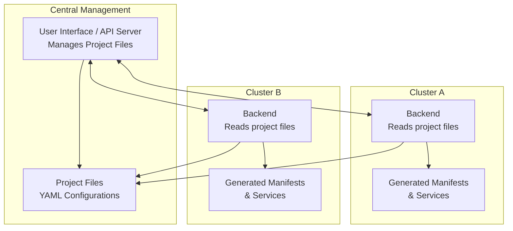
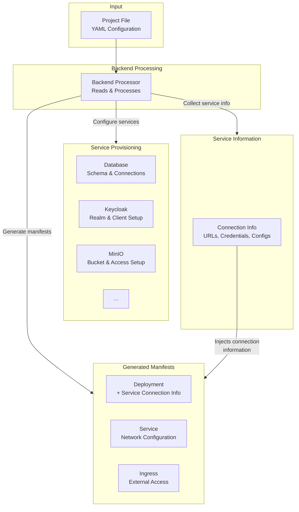

# Operations Manager Architecture

## Overview

The Operations Manager (OPI) consists of a **frontend** web interface and a **backend** FastAPI service deployed in each cluster. The backend processes project files to create complete "deployments" - combinations of Kubernetes manifests and required services like databases, storage, and authentication.

## System Architecture

## Backend Processing Detail

## Key Concepts

**Frontend**: Web interface where project teams configure their deployments through forms

**Backend**: FastAPI application deployed in each cluster that wants to be managed

**Project File**: YAML configuration defining what the project needs (app specs, database, storage, etc.)

**Deployment**: Complete environment created from a project file, including:
- Kubernetes manifests (deployments, services, ingress)
- Required services (PostgreSQL database, MinIO storage, Keycloak authentication)
- Networking and security policies

**Processing Flow**: 
1. Project File → Backend Processing 
2. Backend sets up required services (DB, Auth, Storage)
3. Service connection information is automatically injected into Kubernetes manifests
4. Generated manifests deployed to cluster with all necessary service connectivity