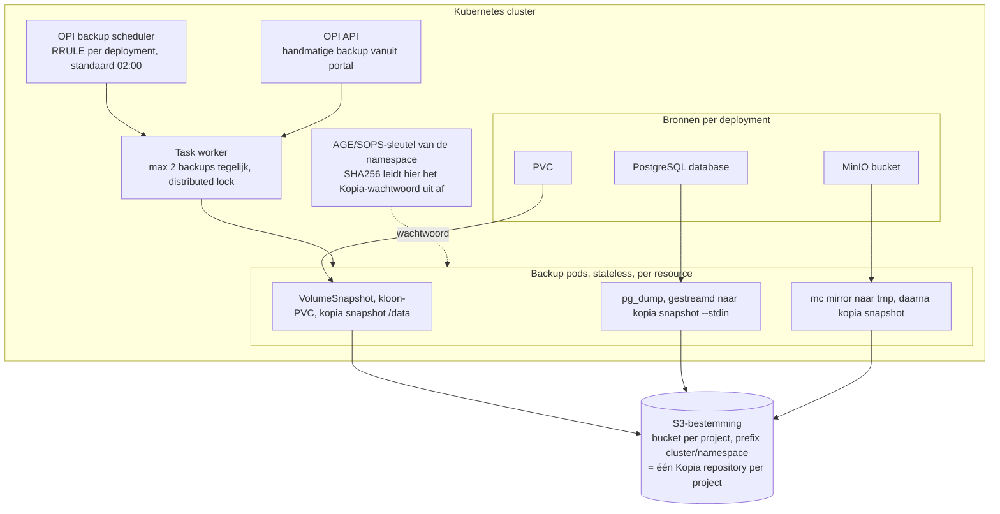
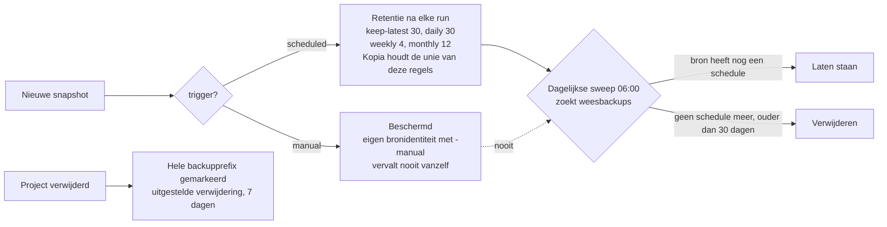

# Hoe onze backups werken

Kort overzicht van de huidige ZAD-backupketen, als onderlegger bij het gesprek over storage buiten het cluster (NetApp of Ceph).

**De kern**: de Operations Manager (OPI) maakt per deployment backups van PVC's, PostgreSQL-databases en MinIO-buckets, versleutelt ze per project met Kopia en schrijft ze naar een S3-bestemming. Die bestemming hoort buiten het cluster te staan, want een backup die op dezelfde opslag ligt als de productiedata beschermt je niet tegen het verlies van die opslag.

## De keten in één plaat

## Wat we wel en niet backuppen

| Wat | Backup | Hoe |
|---|---|---|
| PVC's van componenten | Ja | VolumeSnapshot (copy on write), kloon-PVC, Kopia-snapshot van die kloon |
| PostgreSQL-databases | Ja | `pg_dump` rechtstreeks de Kopia-snapshot in, geen tussenbestand op schijf |
| MinIO-buckets van projecten | Ja | `mc mirror` van de bucket naar een tijdelijke map, daarna Kopia-snapshot |
| De MinIO-installatie zelf | Nee | Alleen de inhoud van de buckets die bij een deployment horen. Users, policies en serviceaccounts van MinIO zitten er niet in; die worden opnieuw aangemaakt vanuit het projectbestand |
| De backupbestemming zelf | Nee | Dat is het eindpunt van de keten, daar zit geen tweede kopie achter |
| Cluststaat en manifesten | Niet nodig | Die staan in Git (zad-projects, zad-argo-user-applications, zad-deployments) en worden door ArgoCD teruggezet |

Kan MinIO zelf wel gebackupt worden? De data ja, dat doen we al per bucket. Wat ontbreekt is de configuratielaag (IAM-policies, accounts) en de garantie dat we alle buckets zien: we backuppen wat een project in zijn projectbestand declareert, niet wat er toevallig in de MinIO staat. Een volledige MinIO-kluis vraagt om replicatie naar een tweede MinIO of om een bucketniveau-export van de IAM.

## De stappen van een backuprun

1. De scheduler tikt elke 10 minuten en kijkt per deployment of er een `backup.schedule` (RRULE) staat die vandaag aan de beurt is, in Amsterdamse wandkloktijd. Inhaalvenster is 4 uur, dus na een korte OPI-storing loopt de run alsnog.
2. Er wordt één taak gemaakt met één `backup_run_id`, zodat alle snapshots uit die run bij elkaar horen in de portal.
3. Per resource haalt OPI de AGE-sleutel van de namespace op en leidt daaruit het Kopia-wachtwoord af.
4. OPI start een backup pod in de namespace van het project. De pod verbindt met de Kopia-repository (of maakt hem aan), maakt de snapshot met tags, en past daarna retentie toe.
5. Tijdelijke spullen (VolumeSnapshot, kloon-PVC, pod) worden opgeruimd.
6. Een distributed lock zorgt dat er niet twee runs door elkaar lopen; er draaien maximaal twee backup- of restoretaken tegelijk.

Restore loopt dezelfde weg terug. Voor een RIG-project schrijft een restore een nieuwe PVC-generatie (`...-pvc-v2`), zet dat in het projectbestand, commit naar Git, en laat ArgoCD omschakelen. Zo is een restore een normale, terugdraaibare deploy en geen handwerk.

## Sleutels

- Elke namespace heeft een eigen AGE-sleutel (dezelfde die we voor SOPS gebruiken).
- Het Kopia-repositorywachtwoord is `SHA256("kopia-backup-<namespace>-<agekey>")`, base64, eerste 32 tekens. Er staat dus nergens een aparte backupsleutel die we moeten beheren, en er is geen lijst met wachtwoorden die kan lekken.
- Gevolg: één repository per project, met een eigen sleutel. Project A kan de backups van project B niet lezen, ook niet als het bij de S3-bucket zou kunnen.
- Gevolg twee, en dat is de belangrijke: **raak je de AGE-sleutel van een namespace kwijt, dan is die backup onleesbaar.** De sleutels leven in het cluster en in `security/`. Dat is een tweede reden om niet alles op één plek te hebben.
- De S3-credentials zelf staan versleuteld in de OPI-secrets (SOPS).

## Retention en verwijderen

Drie mechanismen die verwijderen, en dat is bewust:

1. **Per run.** Aan het eind van elke geplande run draait `kopia snapshot expire` op precies die ene bron. Standaard blijven de laatste 30, plus 30 dagelijkse, 4 wekelijkse en 12 maandelijkse punten bewaard. Kopia houdt de unie, dus je zit op ruwweg een jaar historie met afnemende korrel.
2. **Handmatige backups vervallen niet.** Die krijgen een eigen Kopia-bronidentiteit (`...-manual`), waar de retentie van de geplande run niet bij kan. Ze gaan alleen weg als iemand ze expliciet verwijdert.
3. **De dagelijkse sweep.** Retentie draait alleen als er nog gebackupt wordt. Voor een verwijderde deployment, een weggehaald schema of een uitgezet project stopt dat, en dan zouden snapshots eeuwig blijven staan. De sweep ruimt die wezen op na 30 dagen. In productie staat de sweep nu nog in dry run: hij logt wat hij zou verwijderen en verwijdert niets.

Verwijder je een heel project, dan wordt de complete backupprefix gemarkeerd voor uitgestelde verwijdering met 7 dagen speling, zodat een vergissing terug te draaien is.

## Waar de bytes vandaag landen, en waarom dit gesprek nodig is

De code noemt de bestemming "external S3", maar wat we volgens git uitrollen is een MinIO die we zelf in het cluster zetten: namespace `rig-prd-backup`, één deployment, één PVC van 100Gi op storageClass `ocs-storagecluster-ceph-rbd`. Dat is dezelfde Ceph waarop de productiedata staat.

Daarmee dekken we vandaag wel het scenario "iemand gooit per ongeluk een database of PVC weg" en "een deploy sloopt de data", maar niet:

- verlies of corruptie van de Ceph-cluster zelf,
- een cluster dat niet meer opkomt,
- het wegvallen van de locatie.

Dat is de voornaamste reden om de backupopslag buiten het cluster te trekken: **we willen de data terug kunnen halen als het cluster zelf het probleem is.** Alles wat we hierboven bouwden (versleuteling per project, retentie, restore via Git) blijft precies hetzelfde; alleen het endpoint verandert.

## Wat we van een externe bestemming vragen

| Eis | Waarom |
|---|---|
| S3-compatibel endpoint | De hele keten praat S3 via Kopia en `mc`. NetApp StorageGRID of een Ceph RGW buiten dit cluster passen daar allebei op |
| Bereikbaar vanuit de projectnamespaces | De backup pods draaien in de namespace van het project, niet centraal. NetworkPolicies moeten die egress toestaan |
| Eigen faaldomein | Andere hardware, bij voorkeur andere locatie. Een bucket op dezelfde Ceph lost het probleem niet op |
| Append-achtige of afgeschermde rechten | Wie het cluster overneemt, mag niet in één beweging ook de backups kunnen wissen |
| Capaciteit met ruimte | De huidige 100Gi is een testmaat. Kopia dedupliceert wel, maar onze pods zijn stateless en missen de lokale cache, dus we profiteren daar nu maar beperkt van (zie `features/backup-kopia-incremental-deduplication.md`) |
| TLS | `BACKUP_S3_USE_TLS` staat er al voor klaar |

## Verder lezen

- `features/backup-system.md`, de volledige beschrijving met API's
- `features/scheduled-backups.md`, planning en RRULE
- `features/backup-retention-sweep.md`, de opruimlogica
- `features/backup-kopia-incremental-deduplication.md`, waarom incrementeel nu nog niet echt incrementeel is
