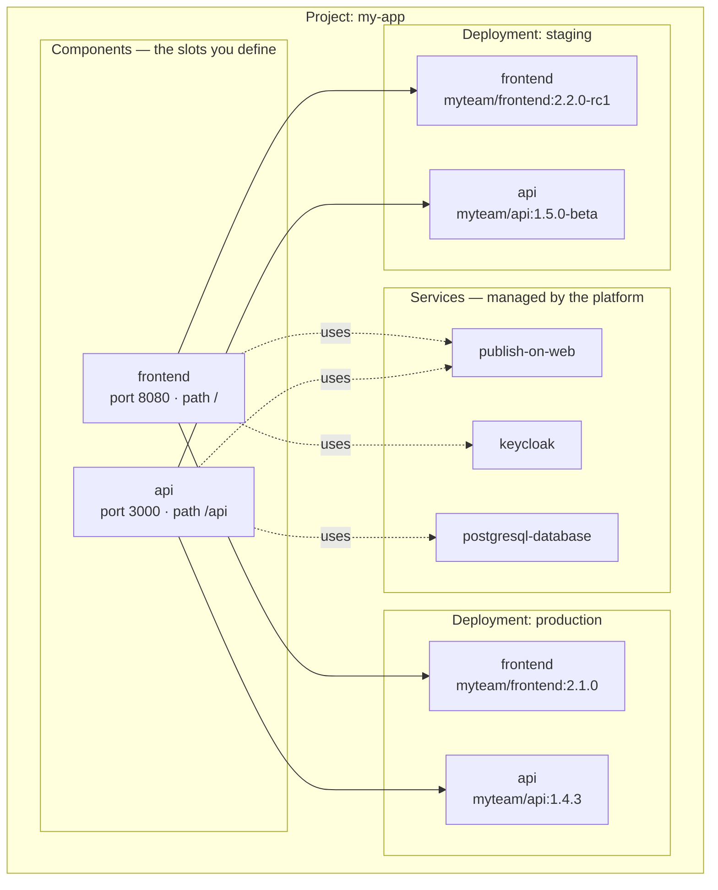
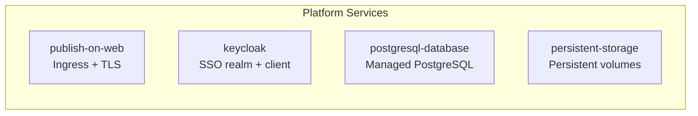
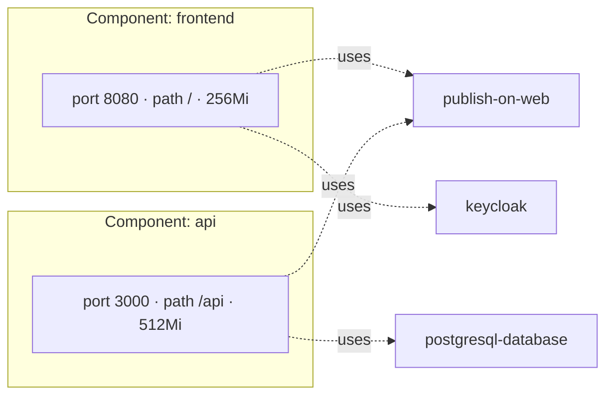
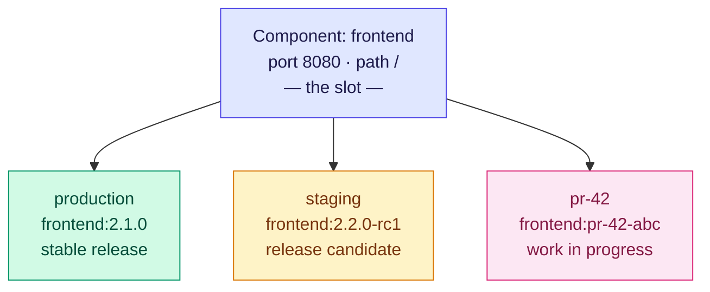
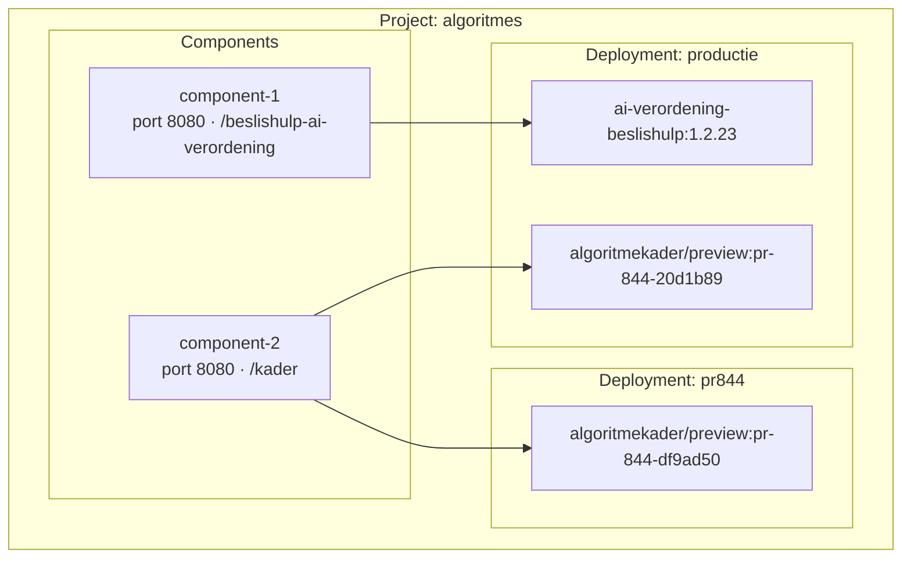

# How ZAD Projects Work

## Four Concepts

| Term | What it is | In the YAML |
|------|-----------|-------------|
| **Project** | Your team's boundary — groups everything together | top-level |
| **Service** | A platform-managed feature: database, SSO, web access, storage | `services[]` |
| **Component** | A slot that describes a deployable part of your app — port, path, resources. No image. | `components[]` |
| **Deployment** | A named instance that runs your components with specific images. Could be "production", "pr-844", or "janes-dev". | `deployments[]` |

A **binding** is when a component says `uses-services: [publish-on-web]` — it connects a component to a service.

---

## The Big Picture



---

## Step by Step

### 1. Create a Project

A project is your team's space. It holds everything: components, services,
deployments, and team members.

```yaml
name: my-app
description: Our awesome app
clusters:
  - odcn-production
users:
  - email: jane@rijksoverheid.nl
    role: admin
```

---

### 2. Pick Services

Services are platform features that ZAD provisions and manages for you.
You just say *"I need this"* — the platform does the rest.

```yaml
services:
  - publish-on-web              # makes your app reachable on the internet
  - keycloak                    # gives you SSO authentication
  - postgresql-database         # gives you a managed database
```

Available services:



---

### 3. Define Components

A component is a **slot** — it describes the shape of a deployable part of your app.

It answers:
- What **port** does it listen on?
- What URL **path** does it serve?
- How much **CPU and memory** does it need?
- Which **services** does it use? (bindings)

```yaml
components:
  - name: frontend
    type: single
    ports:
      inbound: [8080]
    path: /
    resources:
      cpu: 100m
      memory: 256Mi
    uses-services:              # bindings
      - publish-on-web
      - keycloak

  - name: api
    type: single
    ports:
      inbound: [3000]
    path: /api
    resources:
      cpu: 200m
      memory: 512Mi
    uses-services:
      - publish-on-web
      - postgresql-database
```

**There is no Docker image here.** A component describes what the slot looks like,
not what fills it. That happens next.



---

### 4. Create Deployments

A deployment fills the component slots with actual Docker images and puts them
on a cluster with a domain name.

You can have as many deployments as you want — "production", "staging", "pr-844",
"demo-for-client", "janes-dev" — whatever you need.

```yaml
deployments:
  - name: production
    cluster: odcn-production
    subdomain: myapp
    base-domain: rijksapps.nl
    components:
      - reference: frontend                   # ← fills the frontend slot
        image: ghcr.io/myteam/frontend:2.1.0  # ← with this image

      - reference: api                        # ← fills the api slot
        image: ghcr.io/myteam/api:1.4.3       # ← with this image

  - name: staging
    cluster: odcn-production
    subdomain: myapp-staging
    base-domain: rijksapps.nl
    components:
      - reference: frontend
        image: ghcr.io/myteam/frontend:2.2.0-rc1   # ← different version

      - reference: api
        image: ghcr.io/myteam/api:1.5.0-beta
```

---

## Why the Image Lives on the Deployment

The same component runs **different versions** in different deployments.
The slot stays the same — the image that fills it changes:



---

## Real Example: algoritmes

Two components, two deployments. Production runs both components.
The PR preview runs only one, with a different image:



- **pr844** only runs component-2 — you don't have to deploy everything
- **component-2** runs a different image version in each deployment
- The component slots don't change — only what fills them

---

## Quick Reference

| Question                                    | Answer                                                          |
|---------------------------------------------|-----------------------------------------------------------------|
| Where do I define ports, paths, resources?  | In the **component**                                            |
| Where do I pick a database or SSO?          | In **services**, then bind them to a component via uses-services |
| Where do I set the Docker image?            | In the **deployment**, under `components → image`               |
| Can I have multiple deployments?            | Yes — production, staging, PR preview, anything                 |
| Can a deployment skip a component?          | Yes — only include the ones you need                            |
| Can two deployments use different images?   | Yes — that's the whole point                                    |
